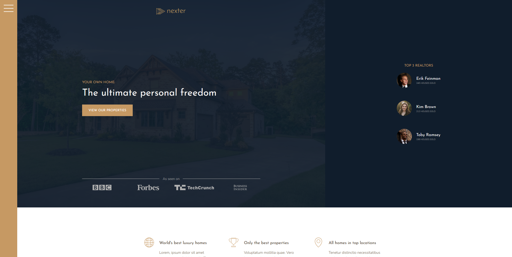
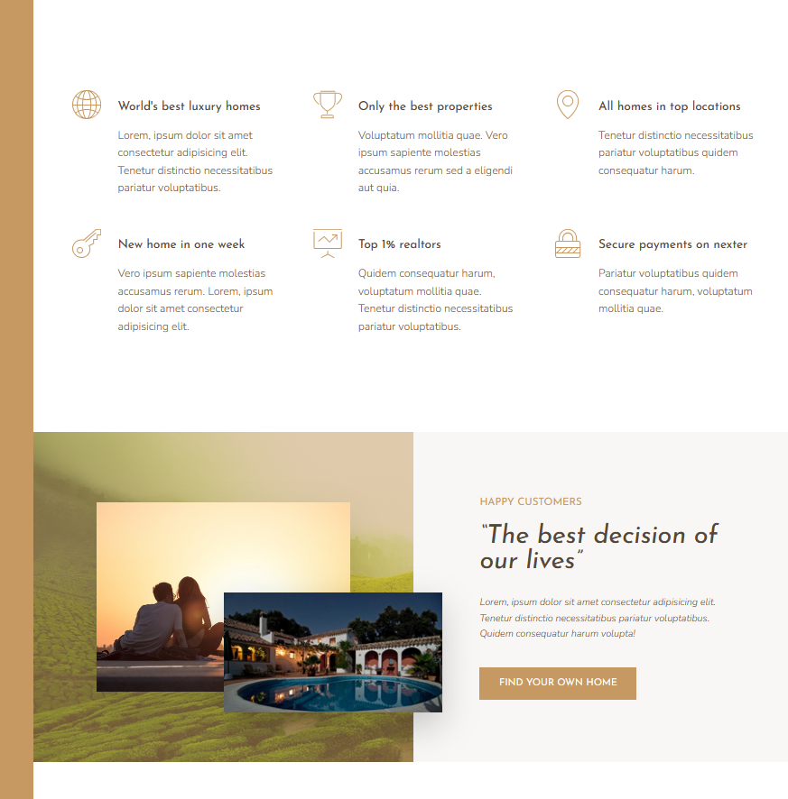
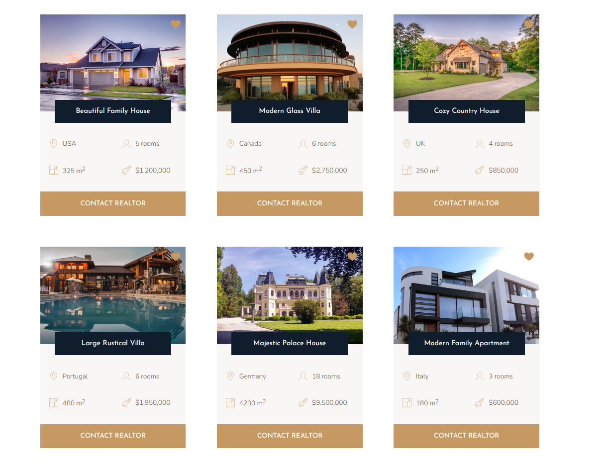
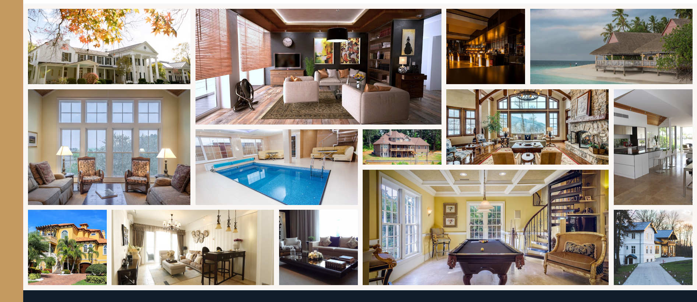

# [Nexter Course Project](patriciazan.github.io/Nexter-Project/)

This is the last project from the course [Advanced CSS and Sass: Flexbox, Grid, Animations and More!](https://www.udemy.com/course/advanced-css-and-sass/) taught by Jonas Schmedtmann on Udemy.
This time I learned and re visited the fundamentals and mastery the Grid layout.

To start this project you must run in the terminal:
```
npm install
```

And to modify and acesses the page you must:
```
npm run start
```
Check the Project [Here](patriciazan.github.io/Nexter-Project/)

_The Header section_
 

 _The Features section_
 

 _The Homes section, they are made with another grid_
 

 _The Gallery, made yet with another grid for a custom look_
 
